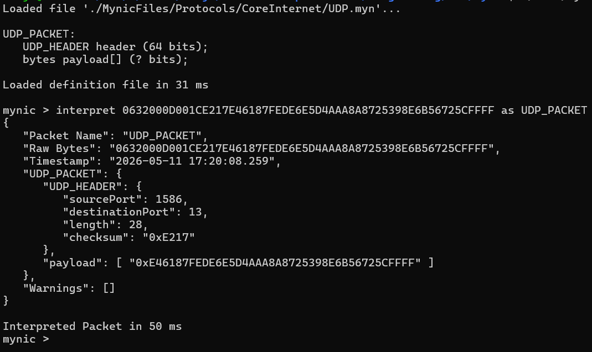

# Mynic

###### High-Performance Binary Protocol Decoder

### Table of Contents

* What is Mynic?
* Why Mynic exists
* Features
* Quick syntax example
* Installation
* Current project status
* Documentation links
* Contributing
* License

### What is Mynic?

Mynic is a high-performance binary decoding tool built around the Mynic Programming Language. It is designed to decode raw streams of binary data into universal, human-readable formats such as JSON.

Mynic can be used across a wide range of industries that rely on raw packet communications, including:

* networking
* robotics
* aerospace and space communications
* radio communications
* embedded systems

### Why Mynic Exists

Mynic exists to solve a simple problem:

There is no fast, universal, and developer-friendly way to parse raw streams of bytes into human-readable data structures.

This problem is especially common when working with binary streams that do not follow IEEE-standardized protocols, as frequently seen in robotics, aerospace, embedded systems, and custom hardware environments.

Most developers and companies either:

* build custom parsers in-house, or
* rely on tools such as Wireshark.

While tools like Wireshark are powerful, they are primarily focused on networking protocols and often require significant setup when working with custom packet formats.

Mynic is designed to make packet schema creation simple, modular, and fast while providing high-performance parsing for both standard and custom protocols.

### Features

- Modular packet schema system
- Reusable protocol components
- JSON export support
- Cross-language integration
- Human-readable protocol definitions
- Designed for custom and non-standard protocols

### A Quick Example

Below is a complete example showing how to parse a User Datagram Protocol (UDP) packet. The definition parses the UDP header and exposes the remaining payload as a stream of bytes.

```mynic
segment UDP_HEADER {
    uint16 sourcePort;
    uint16 destinationPort;
    uint16 length;
    bytes2 checksum;
}

packet UDP_PACKET {
    UDP_HEADER header;
    bytes payload[TO_END];
}
```

Below is a screenshot of interpreting a raw UDP packet using the Mynic CLI.



Mynic's modular design allows components from different packet definitions to be reused together.

For example, if the payload structure is known, the UDP header can be combined with a custom packet definition without redefining the header itself.

This enables rapid construction of complex protocol parsers from reusable building blocks.

### Installation

Mynic will eventually be distributed in multiple forms and integrated with additional languages such as Python.

At the moment, the CLI executable is the recommended installation method.

Installation instructions can be found in: `docs/user-guide/getting-started.md`.

### Project Status

Mynic version 1.0.0 has been released and is currently functional and stable.

However, the project is still actively evolving, and many planned features, optimizations, and tooling improvements are still in development.

### Documentation

All documentation can be loaded in the `docs` folder.

#### User Documentation

User-focused documentation is located in: `docs/user-guide`.

#### Contributor Documentation

Examples can be found in: `docs/contributor-guide`.

#### Examples

Examples are also located in `docs/examples`.

These examples include:

* custom packet definitions
* event-based packet handling
* protocol composition
* advanced parsing workflows

### Contributing

Contribution guidelines are located in: `docs/contributor-guide/CONTRIBUTING.md`

Contributions, issue reports, feature requests, and feedback are welcome.

### License

Licensing information can be found in:

```text
LICENSE.txt
NOTICE.txt
README_LICENSE.md
```

Mynic is licensed under **Apache License 2.0 with Commons Clause**.

You are free to:

- Use Mynic for personal or commercial projects
- Modify the source code
- Redistribute original or modified versions
- Use Mynic internally in commercial products

You may NOT:

- Sell Mynic itself
- Sell modified versions of Mynic
- Offer Mynic or derivatives as a paid product or service

Attribution to the original author (Benjamin Manwell) is required in all redistributions.

---
